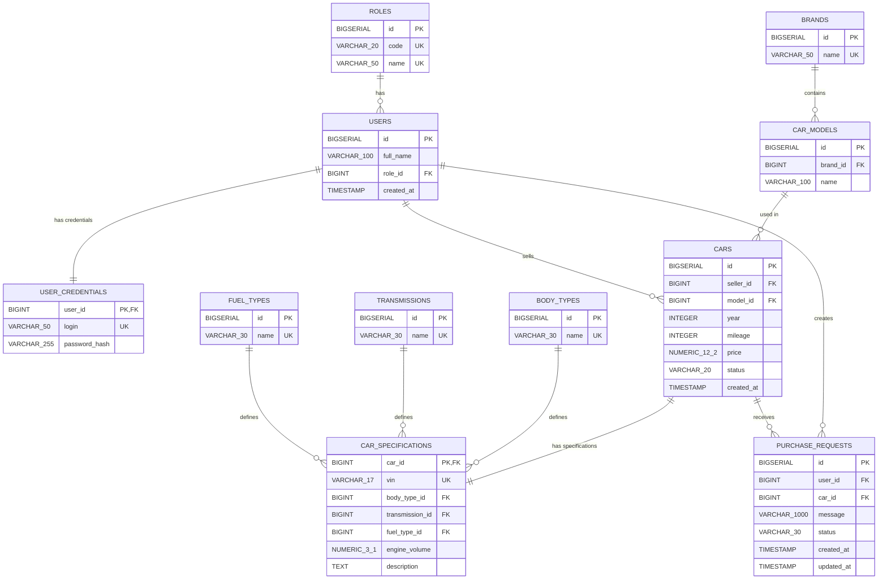

# Маркетплейс автомобилей с пробегом

Консольное приложение на Java для учебной работы (КР1).

## Технологии

- Java 17
- Maven
- PostgreSQL
- JDBC
- Apache POI
- JUnit

## PostgreSQL

1. Создай базу `auto_sale` и выполни SQL-скрипт (таблицы, тестовые данные, индексы) в DBeaver.
2. Настрой подключение в `src/main/resources/database.properties`:

```properties
db.url=jdbc:postgresql://localhost:5432/auto_sale
db.user=postgres
db.password=...
```

При необходимости можно переопределить через переменные окружения: `DB_URL`, `DB_USER`, `DB_PASSWORD`.

**Тестовые логины** (из seed-данных): `admin` / `admin123` (ADMIN), `ivan`, `petr`, `alex`, `dmitry` (пароль `12345`).

## Сборка

```bash
mvn clean compile
```

## Тесты

```bash
mvn test
```

Интеграционные тесты репозитория (`RepositoryTest`, `CrudRepositoryTest`) требуют запущенный PostgreSQL с заполненной БД. Тесты сервисов работают без БД.

## Запуск (этап 1)

```bash
java -cp target/classes carmarket.Main
```

## Структура проекта

```
src/main/java/carmarket/
    Main.java
    model/
    enums/
    repository/
    service/
    ui/
    interfaces/
    exception/
    util/
```

## Статус разработки

- [x] Этап 1 — инициализация Maven-проекта
- [x] Этап 2 — схема базы данных PostgreSQL
- [x] Этап 3 — модели и enum
- [x] Этап 4 — JDBC и Repository
- [x] Этап 5 — CRUD
- [x] Этап 6 — бизнес-логика
- [x] Этап 7 — поиск, фильтрация, сортировка
- [x] Этап 8 — консольное меню
- [x] Этап 9 — обработка ошибок ввода
- [x] Этап 10 — статистика
- [x] Этап 11 — экспорт в Excel
- [x] Этап 10 — статистика
- [x] Этап 11 — экспорт в Excel
- [x] Этап 12 — просмотр таблиц БД
- [x] Этап 13 — финальная проверка

## Назначение проекта

Проект представляет собой консольный маркетплейс автомобилей с пробегом.

Основные сущности:
- `PurchaseRequest` - заявка пользователя на покупку автомобиля
- `User` - пользователь системы
- `Car` — автомобиль, размещённый на продаже
- `PurchaseRequest` — заявка пользователя на покупку автомобиля

Связи между сущностями:

```
User 1:N Car
User 1:N PurchaseRequest
Car  1:N PurchaseRequest
```

Обычный пользователь работает с автомобилями и своими заявками. Администратор имеет дополнительные возможности управления данными и просмотра статистики.

## Архитектура проекта

В проекте используется простая многослойная архитектура:

```
Console UI
    ↓
Service
    ↓
Repository
    ↓
JDBC
    ↓
PostgreSQL
```

### Console UI

Отвечает за:

- меню программы
- ввод данных пользователя
- вывод результатов
- обработку действий пользователя

### Service

Отвечает за:

- бизнес-логику
- проверки данных
- выполнение бизнес-правил
- вызов Repository

### Repository

Отвечает за:

- SQL-запросы
- работу с JDBC
- CRUD-операции
- получение данных из PostgreSQL

### DatabaseManager

Отвечает за создание подключения к PostgreSQL.

## Основные возможности

### Обычный пользователь

Обычный пользователь может:

- просматривать автомобили
- находить автомобиль по марке или модели
- просматривать автомобиль по ID
- подавать заявку на покупку
- просматривать свои заявки
- просматривать свои данные
- выходить из аккаунта

### Администратор

Администратор может:

- просматривать пользователей
- работать с автомобилями
- работать с заявками
- выполнять поиск
- выполнять фильтрацию
- выполнять сортировку
- просматривать статистику
- экспортировать данные в Excel
- просматривать данные таблиц базы данных
- выходить из аккаунта

## Бизнес-правила

В проекте реализованы следующие основные правила:

1. Нельзя создать заявку на несуществующий автомобиль
2. Нельзя создать заявку от несуществующего пользователя
3. Нельзя создать заявку на автомобиль со статусом `SOLD` или `ARCHIVED`
4. Пользователь не может иметь более одной активной заявки на один автомобиль
5. Цена автомобиля должна быть больше 0
6. Пробег автомобиля не может быть отрицательным
7. Для заявок разрешены только определённые переходы между статусами

Активные статусы заявки:

```
NEW
IN_PROGRESS
```

Разрешённые переходы:

```
NEW -> IN_PROGRESS
NEW -> CANCELLED

IN_PROGRESS -> APPROVED
IN_PROGRESS -> REJECTED
IN_PROGRESS -> CANCELLED
```

Для статусов `APPROVED`, `REJECTED` и `CANCELLED` дальнейшие переходы не разрешены.

## Поиск

В проекте реализован поиск.

### Автомобили

Поиск выполняется по:

- марке автомобиля
- модели автомобиля

### Заявки

Поиск выполняется по имени пользователя.

## Фильтрация

Реализована фильтрация:

- заявок по статусу
- автомобилей по диапазону цены

## Сортировка

Реализована сортировка:

- автомобилей по цене
- автомобилей по пробегу

Для работы с коллекциями используются стандартные средства Java: `List`, `Map`, `Set`, `Comparator` и `Stream API` там, где это упрощает код.

## Статистика

Программа предоставляет статистику по данным PostgreSQL.

Выводятся:

- количество пользователей
- количество автомобилей
- количество заявок
- количество заявок со статусом `NEW`
- количество заявок со статусом `IN_PROGRESS`
- количество заявок со статусом `APPROVED`
- количество заявок со статусом `REJECTED`
- количество заявок со статусом `CANCELLED`
- средняя цена автомобиля
- средний пробег автомобиля

## Экспорт в Excel

Для экспорта используется библиотека Apache POI.

Основной файл экспорта:

```
marketplace_export.xlsx
```

В Excel создаются листы:

```
Users
Cars
PurchaseRequests
```

Доступны следующие операции:

```
1. Экспорт пользователей
2. Экспорт автомобилей
3. Экспорт заявок
4. Экспорт всех данных
5. Возврат в предыдущее меню
```

Данные для Excel берутся из PostgreSQL через существующие Service и Repository.

## Просмотр таблиц базы данных

В административном меню предусмотрен пункт:

```
9. Таблицы БД
```

После выбора открывается меню:

```
1. Users
2. Cars
3. PurchaseRequests
4. Назад
```

Данные получают через существующие Service и Repository, а SQL находится в Repository.

## Обработка ошибок ввода

`InputHelper` обрабатывает некорректный ввод пользователя, в том числе:

- строку вместо `int`
- строку вместо `long`
- строку вместо `double`
- пустую строку
- отрицательный ID
- несуществующий ID
- некорректную цену
- некорректный пробег

При ошибке программа выводит сообщение и продолжает работу.

## Структура базы данных

Основные таблицы PostgreSQL:

### `users`

Хранит пользователей системы.

Основные данные:

- идентификатор
- ФИО
- логин
- пароль
- роль
- дата создания

Роли:

```
USER
ADMIN
```

### `cars`

Хранит автомобили, размещённые на продаже.

Основные данные:

- продавец
- марка
- модель
- год выпуска
- пробег
- цена
- VIN
- тип кузова
- коробка передач
- тип топлива
- объём двигателя
- описание
- статус
- дата создания

Статусы автомобилей:

```
AVAILABLE
RESERVED
SOLD
ARCHIVED
```

### `purchase_requests`

Хранит заявки пользователей на покупку автомобилей.

Основные данные:

- пользователь
- автомобиль
- сообщение
- статус
- дата создания
- дата обновления

Статусы заявок:

```
NEW
IN_PROGRESS
APPROVED
REJECTED
CANCELLED
```

## ER-диаграмма




Основные связи между таблицами:

```
ROLES 1:N USERS - одна роль может принадлежать многим пользователям.
USERS 1:1 USER_CREDENTIALS - учётные данные принадлежат одному пользователю; user_id одновременно PK и FK.
BRANDS 1:N CAR_MODELS - у одной марки может быть много моделей.
CAR_MODELS 1:N CARS - одна модель может использоваться в нескольких объявлениях.
USERS 1:N CARS - один пользователь может продавать несколько автомобилей.
CARS 1:1 CAR_SPECIFICATIONS - технические характеристики вынесены в отдельную таблицу; car_id одновременно PK и FK.
BODY_TYPES 1:N CAR_SPECIFICATIONS - один тип кузова может использоваться у многих автомобилей.
TRANSMISSIONS 1:N CAR_SPECIFICATIONS - одна коробка передач может использоваться у многих автомобилей.
FUEL_TYPES 1:N CAR_SPECIFICATIONS - один тип топлива может использоваться у многих автомобилей.
USERS 1:N PURCHASE_REQUESTS - один пользователь может создать несколько заявок.
CARS 1:N PURCHASE_REQUESTS - на один автомобиль может быть несколько заявок.
```
